[English](README.md) · [繁體中文](README.zh-TW.md) · [日本語](README.ja.md) · [한국어](README.ko.md)

# Open Agent Usage

AI 코딩 에이전트의 사용량 할당량이 얼마나 남았는지 메뉴 막대에 보여주는 macOS 상주 앱입니다. **Claude Code**, **Codex**, **Gemini**, **Antigravity** 네 가지 서비스를 지원합니다.

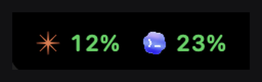

평소에는 이렇게 보입니다. 메뉴 막대의 작은 막대에 서비스마다 아이콘과 퍼센트가 나란히 표시됩니다.

## 주요 기능

- **4개 에이전트를 한 줄에서 확인** — Claude Code, Codex, Gemini, Antigravity의 사용량을 나란히 표시하므로, 확인할 때마다 앱 4개를 따로 열 필요가 없습니다.
- **세션을 클릭하면 바로 전환** — 패널에는 최근 Claude Code 세션이 프로젝트, 브랜치, 모델, 작업 내용과 함께 나열되며, 클릭하면 해당 창으로 바로 전환됩니다. (Pro)
- **데이터는 Mac 밖으로 나가지 않습니다** — 사용량은 Mac에 이미 존재하는 파일에서만 읽어오며, 어디에도 업로드하지 않습니다. 유일한 예외는 Pro 라이선스를 활성화할 때 한 번 이루어지는 Gumroad와의 통신입니다.
- **라이트/다크, 자동 또는 고정** — 막대와 패널은 기본적으로 macOS 외관 설정을 따르지만, 설정에서 Light 또는 Dark로 고정할 수도 있습니다.
- **4개 언어 지원** — 영어, 번체 중국어, 일본어, 한국어를 재시작 없이 즉시 전환할 수 있습니다.

## 확장 패널

메뉴 막대 아이콘을 클릭하면 전체 패널이 열립니다.

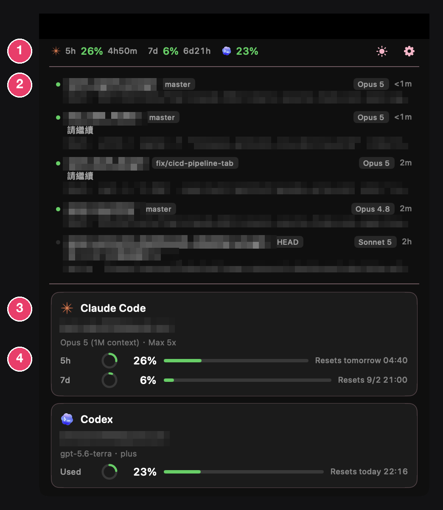

스크린샷에 보이는 프로젝트 이름, 터미널 명령어, 계정 이메일은 개인정보 보호를 위해 의도적으로 흐리게 처리한 것입니다. 이미지가 깨진 것이 아닙니다.

1. **사용량 막대** — 모든 한도를 나란히 표시합니다: Claude Code의 5시간 및 7일 한도, Codex의 사용량이 각각의 퍼센트와 초기화까지 남은 시간과 함께 표시됩니다. 같은 줄 오른쪽 끝에는 라이트/다크 전환 버튼과 설정 버튼이 있습니다.
2. **세션 목록** — 최근 Claude Code 세션을 프로젝트, 브랜치, 모델, 유휴 시간, 현재 작업 내용과 함께 표시합니다. 클릭하면 해당 창으로 전환됩니다. 초록 점은 해당 세션이 현재 실행 중임을 나타냅니다.
3. **서비스별 카드** — 각 에이전트에 로그인한 계정, 요금제, 모델을 표시합니다.
4. **한도마다 한 줄씩** — 원형 게이지, 퍼센트, 막대, 초기화 시간이 표시됩니다. 색상은 항상 사용률에 따라 결정됩니다: 30% 이하는 초록색, 60% 이하는 파란색, 80% 이하는 주황색, 80% 초과는 빨간색입니다.

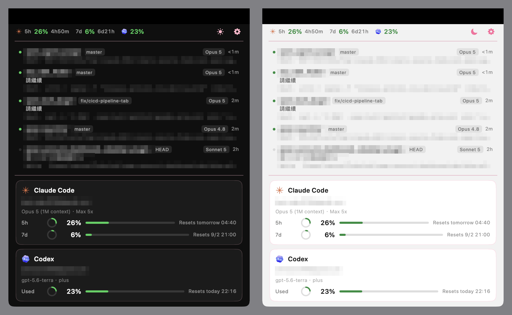

같은 패널의 다크 모드(왼쪽)와 라이트 모드(오른쪽)입니다.

## 무료 버전과 Pro 버전

| | 무료 | Pro |
|---|:---:|:---:|
| 4개 에이전트 전체의 메뉴 막대 사용량 표시 | 지원 | 지원 |
| 라이트/다크 모드, 11가지 강조 색상 | 지원 | 지원 |
| 4개 언어 지원 (영어, 번체 중국어, 일본어, 한국어) | 지원 | 지원 |
| 계정, 요금제, 시간대별 사용량 패널 | 지원 | 지원 |
| 세션 목록 (각 Claude Code 세션이 무엇을 하고 있는지 확인하고 클릭 한 번으로 해당 창으로 이동) | 미지원 | 지원 |
| AI 에이전트가 호출할 수 있는 `open-agent-usage` 명령줄 인터페이스 | 미지원 | 지원 |
| 가격 | 무료 | US$4.99 (일회성 결제) |

새로 설치하면 계정 등록 없이 **모든 Pro 기능을 30일간 무료로 체험**할 수 있습니다. 체험 기간이 끝나도 Pro 라이선스를 구매하지 않는 한 무료 기능은 계속 사용할 수 있습니다.

## 설치 방법

1. [Releases](../../releases/latest)에서 최신 `.dmg`(또는 `.zip`)를 다운로드합니다.
2. 디스크 이미지를 열고 **Open Agent Usage**를 **Applications** 폴더로 드래그합니다.
3. 이 빌드는 아직 **Apple 공증(notarization)을 받지 않았기 때문에**, 처음 실행할 때 macOS Gatekeeper가 이를 차단합니다. 여는 방법은 아래를 참고하십시오.

이 버전은 프리뷰 빌드입니다. 공증된 빌드는 추후 릴리스로 제공될 예정이며, 그전까지는 아래 방법 중 하나로 열어야 합니다.

### 공증되지 않은 앱 열기 (권장 방법)

macOS 15부터는 control 키를 누른 채 클릭해도 우회되지 않습니다. 표시되는 경고에 **"완료"** 버튼만 있기 때문입니다. 시스템 설정을 이용하세요:

1. 먼저 앱을 두 번 클릭합니다. macOS가 열기를 거부하면 경고를 닫습니다.
2. **시스템 설정 → 개인정보 보호 및 보안**을 열고 **"보안"**까지 아래로 스크롤합니다. 앱이 차단되었다는 줄이 나타납니다.
3. **"그래도 열기"**를 클릭한 다음 확인합니다.

이 작업은 처음 한 번만 필요하며, 이후에는 평소처럼 열립니다.

### 대안: 터미널 사용

```bash
xattr -dr com.apple.quarantine /Applications/OpenAgentUsage.app
```

## 추가 설정

### Claude Code 사용량 확인에는 브리지 스크립트가 필요합니다

Claude Code는 사용량 데이터를 상태 표시줄의 표준 입력(stdin)에만 전달할 뿐, 파일로 저장하지 않습니다. Open Agent Usage가 이 데이터를 읽으려면 작은 브리지 스크립트를 설치해야 합니다.

```bash
/Applications/OpenAgentUsage.app/Contents/Resources/scripts/install-claude-bridge.sh
```

이 스크립트는 변경 전에 `~/.claude/settings.json`을 자동으로 백업합니다. 기존 상태 표시줄은 그대로 작동하며 겉모습도 바뀌지 않습니다.

- 설치 상태 확인: `--status` 옵션 사용
- 브리지 제거 및 원래 설정 복원: `--uninstall` 옵션 사용

### Gemini 사용량 확인에는 손쉬운 사용 권한이 필요합니다

**시스템 설정 → 개인정보 보호 및 보안 → 손쉬운 사용**을 열고 **Open Agent Usage**를 활성화합니다.

Gemini 앱이 실행 중이지 않으면 패널의 Gemini 항목은 자동으로 숨겨집니다.

## 설정 화면 안내

### General

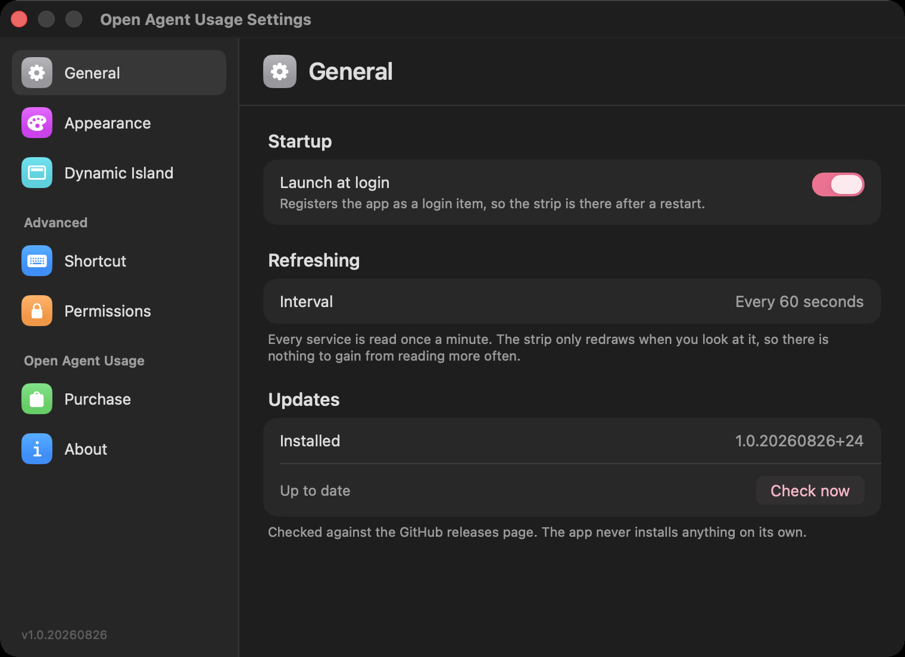

**Launch at login**은 앱을 로그인 항목으로 등록하여, 재시작 후에도 막대가 표시되도록 합니다. **Refresh interval**은 60초로 고정되어 있습니다. 막대는 실제로 볼 때만 다시 그려지므로, 더 자주 읽어도 얻는 것이 없습니다. **Updates**에는 설치된 버전이 표시되며, **Check now** 버튼으로 GitHub 릴리스 페이지와 대조해 확인합니다. 앱이 스스로 무언가를 설치하는 일은 없습니다.

### Appearance

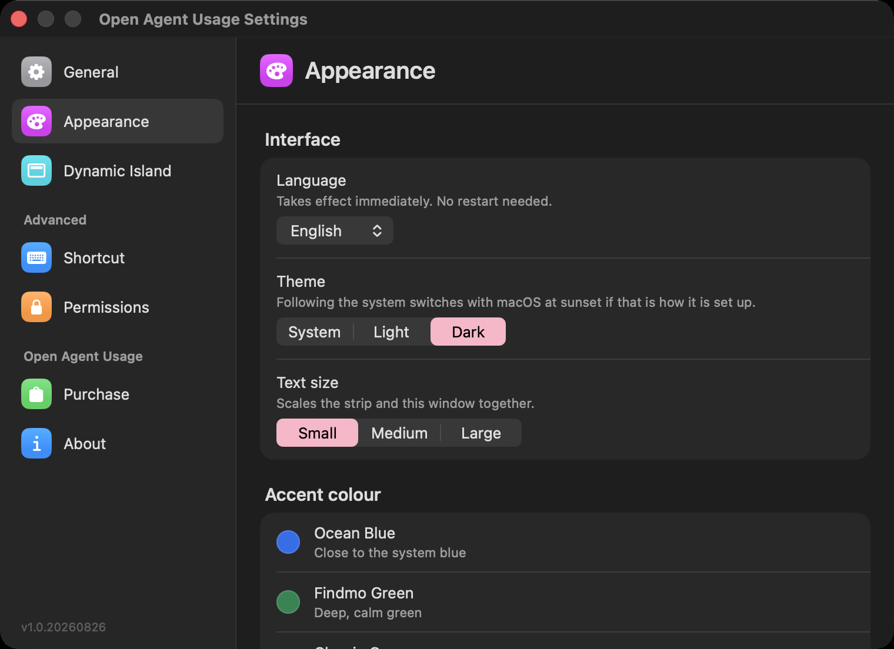

**Language**는 즉시 적용되며 재시작이 필요 없습니다. **Theme**는 기본적으로 macOS를 따르지만, **Light** 또는 **Dark**로 고정할 수도 있습니다. **Text size**(Small/Medium/Large)는 막대와 이 설정 창을 함께 확대·축소합니다.

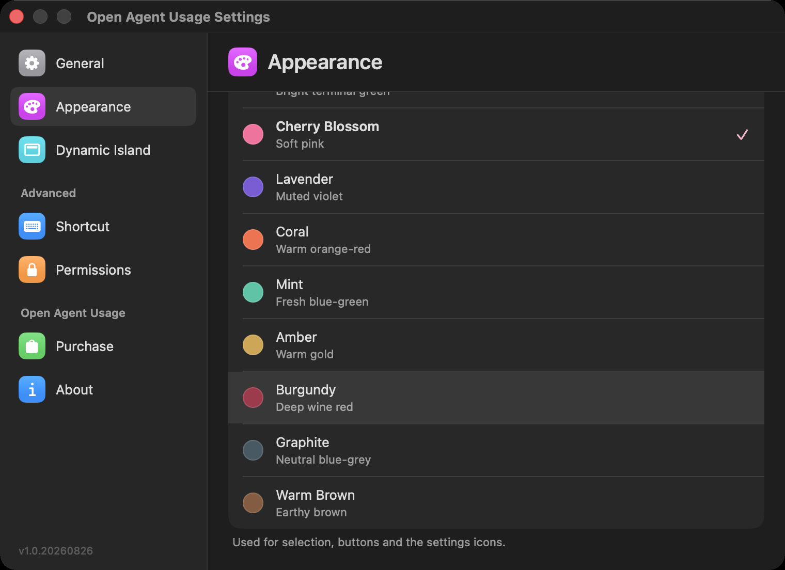

같은 페이지를 아래로 스크롤하면 **11가지 강조 색상**이 나타납니다. Ocean Blue, Findmo Green부터 Cherry Blossom, Lavender, Coral, Mint, Amber, Burgundy, Graphite, Warm Brown까지입니다. 강조 색상은 선택 표시, 버튼, 설정 아이콘에 사용됩니다.

### Dynamic Island

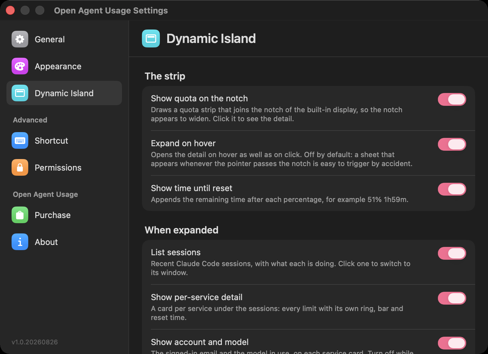

**Show quota on the notch**는 내장 디스플레이의 노치에 이어지는 사용량 막대를 그려서 노치가 넓어진 것처럼 보이게 합니다. 클릭하면 상세 정보를 볼 수 있습니다. **Expand on hover**는 클릭뿐 아니라 마우스를 올려도 상세 정보가 열리도록 합니다. 기본값은 꺼짐입니다. 포인터가 노치를 지날 때마다 시트가 열리면 실수로 트리거되기 쉽기 때문입니다. **Show time until reset**은 각 퍼센트 뒤에 초기화까지 남은 시간을 덧붙입니다. 예: `51% 1h59m`.

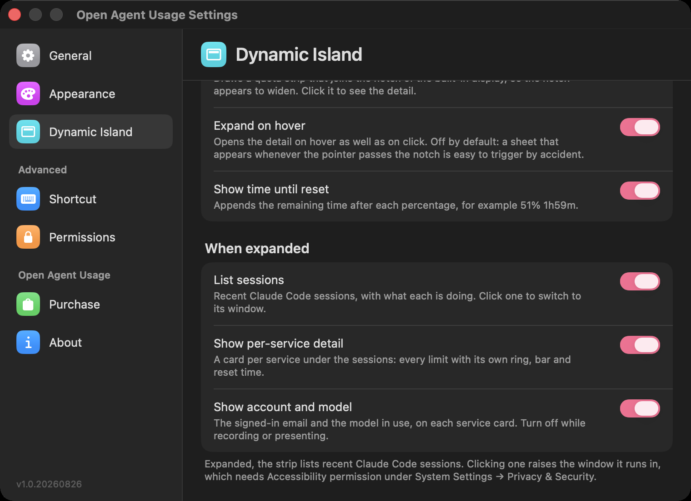

같은 페이지를 아래로 스크롤하면 **When expanded** 항목에서 전체 패널에 표시할 내용을 제어할 수 있습니다. **List sessions**(최근 Claude Code 세션과 각 세션이 하는 작업을 나열하고, 클릭하면 해당 창으로 전환), **Show per-service detail**(서비스마다 카드 하나씩, 각 한도의 원형 게이지·막대·초기화 시간 표시), **Show account and model**(각 서비스 카드에 로그인된 이메일과 사용 중인 모델 표시 — 녹화나 화면 공유 중에는 꺼두는 것이 좋습니다).

### Shortcut

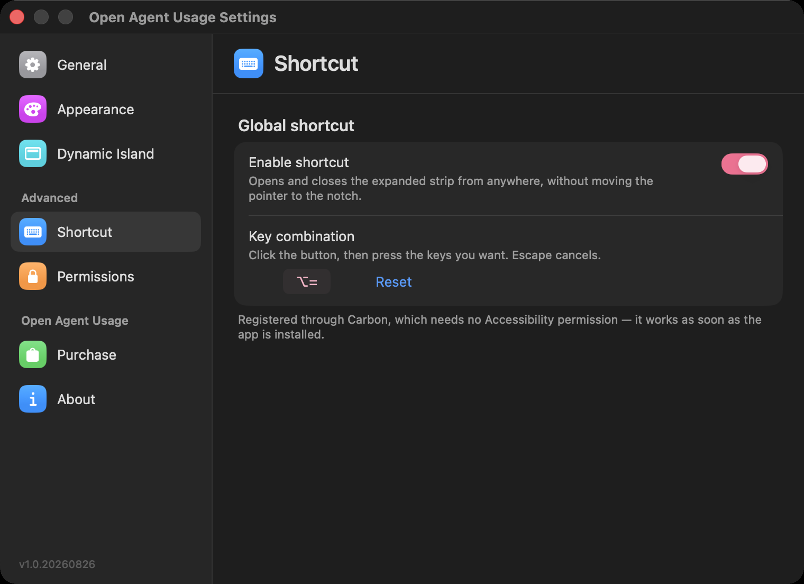

**Enable shortcut**을 켜면 포인터를 노치까지 옮기지 않아도 어디서든 확장 패널을 열고 닫을 수 있는 전역 단축키가 활성화됩니다. 키 조합 버튼을 클릭한 다음 원하는 키를 누르면 됩니다. Escape로 취소할 수 있고, **Reset**으로 기본값으로 되돌릴 수 있습니다. 이 단축키는 Carbon을 통해 등록되므로 손쉬운 사용 권한이 필요 없습니다. 앱을 설치하는 즉시 작동합니다.

### Permissions

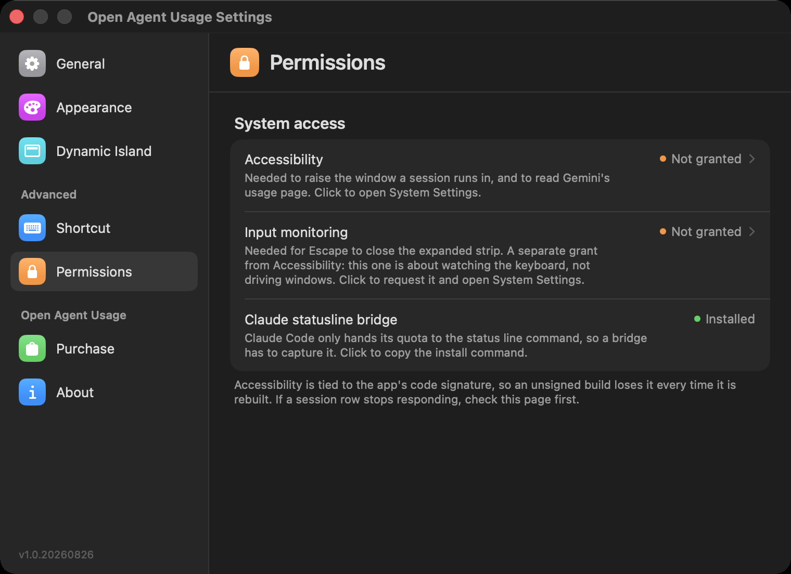

**Accessibility**(손쉬운 사용)는 세션이 실행 중인 창을 앞으로 가져오고 Gemini의 사용량 페이지를 읽기 위해 필요합니다. 이 항목을 클릭하면 시스템 설정이 열립니다. **Input monitoring**(입력 모니터링)은 Escape로 확장 패널을 닫기 위해 필요하며, Accessibility와는 별도로 허용해야 합니다. 이것은 창을 조작하는 것이 아니라 키보드 입력을 감시하는 권한입니다. **Claude statusline bridge**는 브리지 스크립트가 설치되어 있는지 표시하며, 클릭하면 설치 명령어를 복사할 수 있습니다. 손쉬운 사용 권한은 앱의 코드 서명에 연결되어 있어서, 서명되지 않은 빌드는 다시 빌드할 때마다 권한을 잃습니다. 세션 항목이 반응하지 않으면 먼저 이 페이지를 확인하십시오.

### Purchase

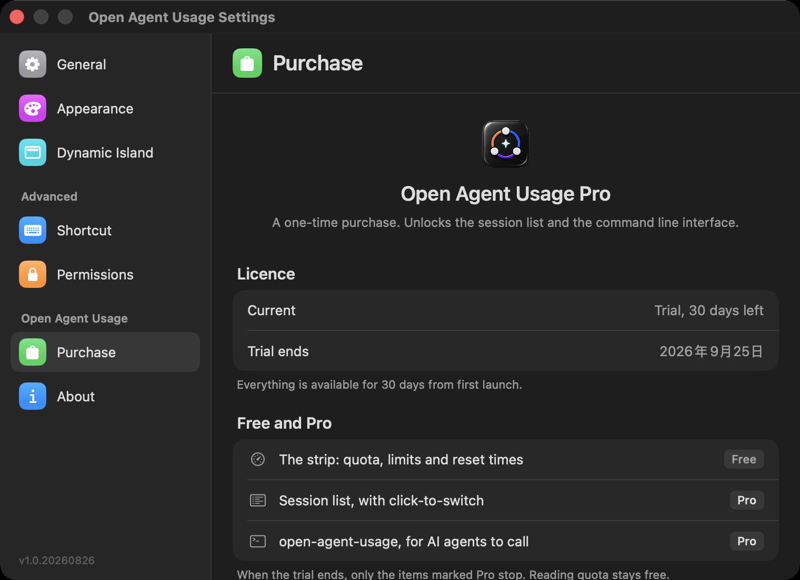

페이지 상단에는 현재 라이선스 상태가 표시되며, 체험 기간 중에는 남은 일수도 함께 표시됩니다. 그 아래 **Free and Pro** 표에는 어떤 기능이 무료(사용량 막대)이고 어떤 기능이 Pro 전용(세션 목록, `open-agent-usage` 명령줄 인터페이스)인지 정리되어 있습니다. 체험 기간이 끝나면 Pro로 표시된 항목만 작동을 멈춥니다.

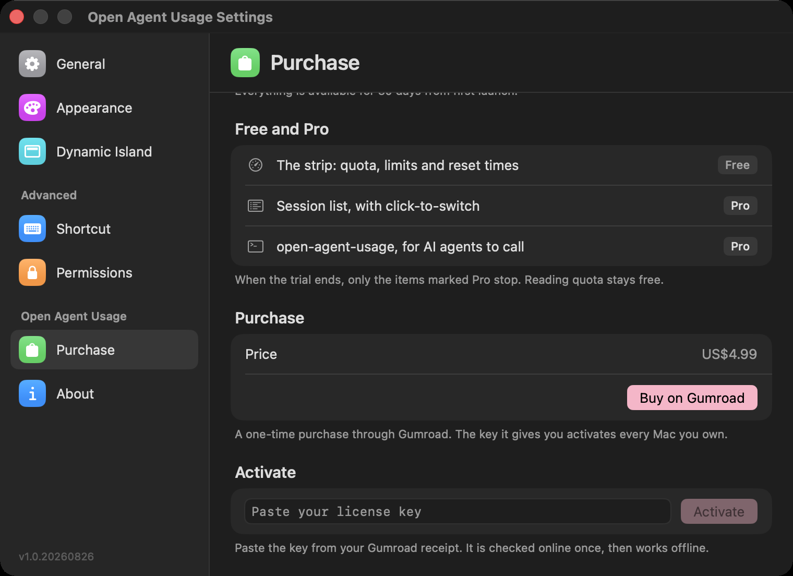

같은 페이지를 아래로 스크롤하면 가격(**US$4.99**)과 **Buy on Gumroad** 버튼, 그리고 라이선스 키를 붙여넣고 활성화하는 입력란이 나타납니다.

### About

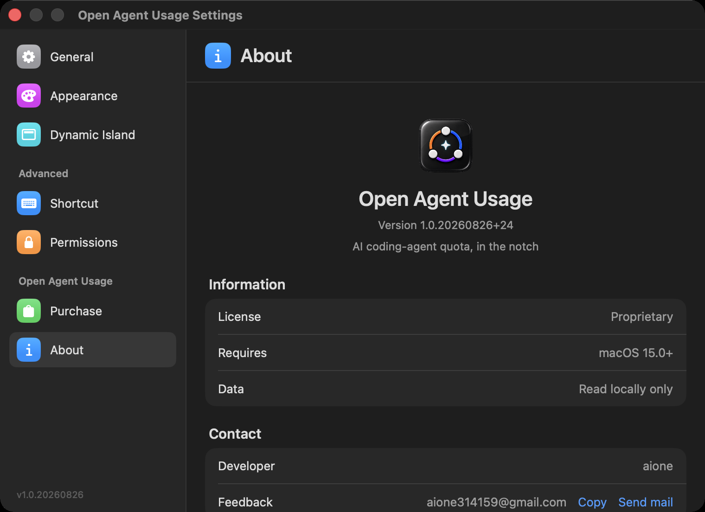

버전 번호, 라이선스(**Proprietary**), 시스템 요구 사항(**macOS 15.0+**), 데이터 안내(**Read locally only**, 로컬에서만 읽음), 그리고 개발자 이름과 복사 버튼이 있는 피드백 이메일이 표시됩니다.

## Pro 구매

Pro 라이선스는 여기에서 구매할 수 있습니다: **https://playmaker12.gumroad.com/l/openagentusage**

구매 후 Gumroad에서 라이선스 키를 이메일로 보내드립니다. 앱의 **설정 → Purchase**에서 키를 붙여넣고 활성화하십시오. 활성화 시 확인을 위해 인터넷 연결이 한 번 필요하며, 이후 Pro 기능은 오프라인에서도 정상적으로 작동합니다.

## 시스템 요구 사항

- macOS 15 이상
- Apple silicon 및 Intel 모두 지원 (universal binary)

## 문제 신고

- 이메일: aione314159@gmail.com
- 또는 이 저장소의 GitHub Issues에 등록

## 라이선스

Open Agent Usage는 상용 소프트웨어이며, 이 저장소에는 소스 코드가 포함되어 있지 않습니다.

Copyright (c) 2026 aione. All rights reserved.
