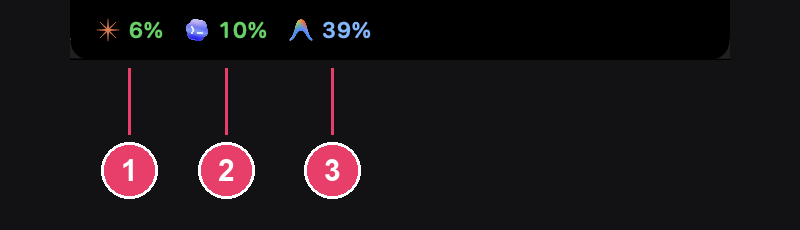

[English](README.md) · [繁體中文](README.zh-TW.md) · [日本語](README.ja.md) · [한국어](README.ko.md)

# Open Agent Usage

一款 macOS 選單列常駐 App，顯示你的 AI coding agent 用量配額還剩多少，涵蓋 **Claude Code**、**Codex**、**Gemini**、**Antigravity** 四個服務。



平常就長這樣：選單列上一小條，每個 agent 一個圖示配一個百分比。上圖這台機器同時跑著三個 agent。

1. **Claude Code** — 5 小時視窗，最先打斷手上工作的那條限制。7 天視窗在展開面板裡。
2. **Codex** — 目前視窗的用量。
3. **Antigravity** — Gemini 模型的配額；第三方模型的配額在展開面板裡。

顏色一律跟著已用量走：30% 以下綠色、60% 以下藍色、80% 以下橘色、超過 80% 紅色。有在跑但讀不到數字的 agent（例如還沒裝橋接的 Claude Code）會留在原位顯示灰色的 `--`，所以圖示從這條上消失，就只代表那個 agent 停了。

## 關鍵功能

- **四個 agent 並排看** — Claude Code、Codex、Gemini、Antigravity 的配額並排顯示，不必開四個不同的 App 才能查剩多少。
- **點一下 session 就切過去** — 面板列出最近的 Claude Code session，顯示專案、分支、模型與各自在做什麼，點一下就直接切到那個視窗。（Pro）
- **資料完全不出你的 Mac** — 用量都是從本機既有的檔案讀取，不會上傳任何東西。唯一的例外是啟用 Pro 授權時，會連一次 Gumroad 做驗證。
- **淺色深色，自動或自選** — 選單列與面板預設跟著 macOS 外觀走，也可以在設定裡強制固定成淺色或深色。
- **4 種語言** — 英文、繁體中文、日文、韓文，切換立即生效，不用重開 App。

## 展開面板

點選單列圖示會打開完整面板。


截圖裡的專案名稱、終端機指令與帳號 email 都是刻意打上馬賽克，為了隱私遮蔽，不是圖檔壞掉。

1. **配額列** — 所有限制並排顯示：Claude Code 的 5 小時與 7 天兩個時間窗、Codex 的用量，各自有自己的百分比與距重置時間。同一列右端有淺色／深色切換與設定按鈕。
2. **Session 清單** — 最近的 Claude Code session，顯示專案、分支、模型、已閒置多久，以及正在跑什麼。點一下就切到那個視窗。綠點代表這個 session 正在執行中。
3. **各服務卡片** — 每個 agent 登入的帳號、方案與模型。
4. **每個限制一列** — 圓環、百分比、長條與重置時間。顏色一律跟著已用量走：≤30% 綠色、≤60% 藍色、≤80% 橘色、>80% 紅色。


同一個面板的深色（左）與淺色（右）外觀。

## 免費 vs Pro

| | 免費 | Pro |
|---|:---:|:---:|
| 四個 agent 的選單列配額顯示 | 有 | 有 |
| 淺色／深色外觀、11 種強調色 | 有 | 有 |
| 4 種語言（英／繁中／日／韓） | 有 | 有 |
| 展開面板看帳號、方案、各時間窗用量 | 有 | 有 |
| Session 清單（看每個 Claude Code session 在做什麼，點一下切過去） | 無 | 有 |
| `open-agent-usage` 命令列介面，給 AI agent 呼叫 | 無 | 有 |
| 價格 | 免費 | US$4.99，一次買斷 |

每次全新安裝都會啟動 **30 天全功能試用**，不需要註冊帳號。試用期結束後，App 仍可正常使用免費功能，除非你購買 Pro 授權。

## 安裝

1. 從 [Releases](../../releases/latest) 下載最新的 `.dmg`（或 `.zip`）。
2. 打開磁碟映像檔，把 **Open Agent Usage** 拖進 **Applications** 資料夾。
3. 按兩下就能開。這個版本以 Developer ID 憑證簽章並經過 Apple 公證，Gatekeeper 直接放行，不會跳警告，也不需要任何繞道步驟。

## 額外設定

### Claude Code 的用量需要多裝一個橋接腳本

Claude Code 只會把配額資料寫進 status line 的標準輸入（stdin），不會把它存成任何檔案。Open Agent Usage 要讀到這份資料，需要先安裝一個小型橋接腳本：

```bash
/Applications/OpenAgentUsage.app/Contents/Resources/scripts/install-claude-bridge.sh
```

腳本執行前會先備份 `~/.claude/settings.json`。你原本的 status line 完全照常運作，外觀不會有任何變化。

- 檢查安裝狀態：加上 `--status`
- 移除橋接並還原原本設定：加上 `--uninstall`

### Gemini 的用量需要輔助使用權限

打開**系統設定 → 隱私權與安全性 → 輔助使用**，勾選 **Open Agent Usage**。

Gemini App 沒有在執行時，選單列面板裡的 Gemini 那一列會自動隱藏。

## 設定頁面逐頁介紹

### General


**Launch at login** 把 App 註冊成登入項目，重開機後選單列還是會在。**Refresh interval** 固定為 60 秒——選單列只有在你真的看它時才會重繪，讀更頻繁也不會拿到更新的資料。**Updates** 顯示目前安裝的版本，按 **Check now** 會對照 GitHub releases 頁面確認；App 不會自己安裝任何東西。

### Appearance


**Language** 立即生效，不用重開 App。**Theme** 預設跟著 macOS 走，也可以固定成 **Light** 或 **Dark**。**Text size**（Small／Medium／Large）會同時縮放選單列與這個設定視窗。


同一頁往下捲可以看到 **11 種強調色**——從 Ocean Blue、Findmo Green 到 Cherry Blossom、Lavender、Coral、Mint、Amber、Burgundy、Graphite、Warm Brown。強調色會用在選取狀態、按鈕與設定圖示上。

### Dynamic Island


**Show quota on the notch** 會畫出一條配額列，跟內建螢幕的瀏海接在一起，看起來像瀏海變寬了，點一下就能看到詳細內容。**Expand on hover** 讓滑鼠移過去也會展開，不只是點擊——預設關閉，因為指標一經過瀏海就跳出來的面板很容易誤觸。**Show time until reset** 會在每個百分比後面加上剩餘時間，例如 `51% 1h59m`。


同一頁往下捲，**When expanded** 這一區控制展開面板要顯示什麼：**List sessions**（列出最近的 Claude Code session 與各自在做什麼，點一下切到那個視窗）、**Show per-service detail**（每個服務一張卡片，每個限制各自的圓環、長條與重置時間）、**Show account and model**（每張服務卡片上顯示登入的 email 與使用中的模型——錄影或簡報時建議先關掉）。

### Shortcut


**Enable shortcut** 開啟一組全域快捷鍵，不用把滑鼠移到瀏海就能從任何地方開合展開面板。點按鍵組合按鈕後直接按你想要的按鍵；Escape 可以取消，**Reset** 會還原成預設值。這組快捷鍵是透過 Carbon 註冊的，不需要輔助使用權限——App 一裝好就能用。

### Permissions


**Accessibility**（輔助使用）用來把 session 所在的視窗拉到前面，以及讀取 Gemini 的用量頁面；點這一列可以打開系統設定。**Input monitoring**（輸入監控）是讓 Escape 能關閉展開面板用的——跟輔助使用是分開授權的，這個是監看鍵盤輸入，不是操控視窗。**Claude statusline bridge** 顯示橋接腳本是否已安裝；點一下可以複製安裝指令。輔助使用權限是綁在 App 的程式碼簽章上的，未簽章的版本每次重新編譯都會失去授權——如果某個 session 列沒反應，先來這一頁檢查。

### Purchase


頁面上半顯示目前的授權狀態，試用期間會顯示還剩幾天。下面的 **Free and Pro** 對照表列出哪些功能是免費的（配額列）、哪些是 Pro 限定（session 清單，以及 `open-agent-usage` 命令列介面）——試用期結束後，只有標 Pro 的項目會停用。


同一頁往下捲會看到價格（**US$4.99**）與 **Buy on Gumroad** 按鈕，還有一個貼上並啟用授權碼的欄位。

### About


版本號、授權條款（**Proprietary**）、系統需求（**macOS 15.0+**）、資料聲明（**Read locally only**，只在本機讀取），以及開發者名稱與附複製按鈕的回報信箱。

## 購買 Pro

在這裡購買 Pro 授權：**https://playmaker12.gumroad.com/l/openagentusage**

購買後 Gumroad 會用 email 寄給你一組授權碼。打開 App 的**設定 → Purchase**，貼上授權碼並啟用。啟用時需要連網驗證一次，之後 Pro 功能離線也能正常使用。

## 系統需求

- macOS 15 或以上
- 支援 Apple silicon 與 Intel（universal binary）

## 問題回報

- Email：aione314159@gmail.com
- 或在本 repo 開 GitHub Issue

## 授權

Open Agent Usage 是專有軟體，本 repo 不含原始碼。

Copyright (c) 2026 aione. All rights reserved.
